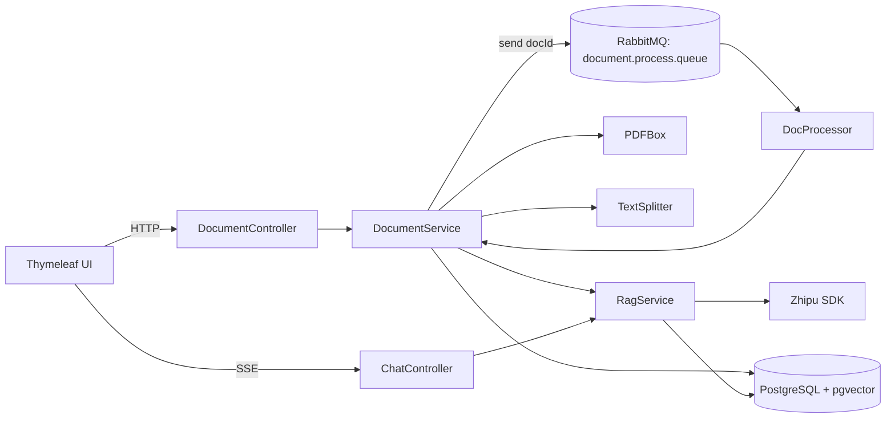

# demo1.0 — Spring Boot RAG 文档问答（PostgreSQL + pgvector + RabbitMQ）

这是一个用于学习/展示 **Java 大模型应用开发（RAG）** 的示例项目：支持用户注册登录、上传 PDF 文档、异步解析与向量入库、基于 **pgvector** 的相似度检索、并以 **SSE 流式输出** 的方式完成文档问答。

> 技术栈：Spring Boot 3.2 + Spring MVC + Spring Data JPA + Thymeleaf + PostgreSQL(pgvector) + RabbitMQ + PDFBox + 智谱 Zhipu SDK

---

## 亮点（可用于简历/面试讲解）

1. **pgvector 向量检索落库**：embedding 存 `vector` 字段，检索在数据库侧完成（`ORDER BY embedding <=> query_vector`）。
2. **企业级异步文档处理**：上传后“秒回”，重任务（解析 PDF → 切块 → embedding → 入库）由 **RabbitMQ** 消费者异步执行，并通过 `DocStatus` 状态机驱动前端展示。
3. **避免 pgvector 映射坑**：相似度查询只取 `text` 字段，通过 **Interface Projection** 返回，绕开 Hibernate 对 `vector` 列的读取/解析问题。
4. **对话体验**：SSE 流式输出 + 前端 Markdown 渲染（marked.js）+ 代码高亮（highlight.js）。
5. **可演进的工程化路线**：当前完成“向量库 + 异步处理”两阶段，后续可继续扩展缓存、重试、观测性、多租户、权限等。

---

## 整体流程（端到端）

### 1) 文档上传与异步入库

1. 用户在 `/doc/upload` 上传 PDF
2. `DocumentController` 将文件保存到本地 `uploads/docs/`，并调用 `DocumentService.saveDocument(...)`
3. `DocumentService.saveDocument(...)`
   - 写入 `Document` 记录（`status=PENDING`）
   - 向 RabbitMQ 队列 `document.process.queue` 投递消息（docId）
4. `DocProcessor`（RabbitMQ consumer）监听队列，调用 `DocumentService.processDocumentAsync(docId)`
5. `processDocumentAsync(...)`
   - `status=PROCESSING`
   - PDFBox 抽取文本
   - `TextSplitter` 递归切块（含 overlap）
   - 对每个 chunk 调用 `RagService.embedding(text)` 生成向量
   - 写入 `DocumentChunk(text, embedding(vector))`
   - `status=COMPLETED`（失败则 `FAILED`）

### 2) 文档对话（RAG + 流式输出）

1. 文档完成后，用户进入 `/chat/start?docId=...`
2. 用户提问：前端通过 SSE 请求 `/chat/ask?conversationId=...&documentId=...&question=...`
3. `ChatController.ask(...)`
   - 写入用户消息到 `chat_message`
   - 调用 `RagService.searchRelevant(documentId, question)`
4. `RagService.searchRelevant(...)`
   - 对 `question` 生成 query embedding
   - 调用 `DocumentChunkRepository.searchSimilar(...)` 进行向量检索（pgvector）
   - 返回最相关的 chunk 文本（Projection：只包含 `text`）
5. `ChatController` 拼装 RAG Prompt，调用智谱模型（stream=true）
6. 后端将 delta 持续写入 SSE；流结束后把最终 AI 回复落库

---

## 架构与模块划分

### 目录结构（核心）

```
src/main/java/com/example/demo
  ├─ controller
  │   ├─ AuthController.java        # 登录/注册/找回密码/主页
  │   ├─ UserController.java        # 个人资料、头像上传
  │   ├─ DocumentController.java    # 文档上传、列表、删除
  │   └─ ChatController.java        # 文档对话（SSE 流式）+ 清空对话
  ├─ service
  │   ├─ DocumentService.java       # 文档状态机、切分、入库、级联删除
  │   ├─ DocProcessor.java          # RabbitMQ 消费者
  │   ├─ RagService.java            # embedding 生成 + 向量检索
  │   └─ UserService.java           # 用户相关
  ├─ repository
  │   ├─ DocumentRepository.java
  │   ├─ DocumentChunkRepository.java      # pgvector native query
  │   ├─ DocumentChunkProjection.java      # 只返回 text
  │   ├─ ConversationRepository.java
  │   └─ ChatMessageRepository.java
  ├─ entity
  │   ├─ User.java
  │   ├─ Document.java              # 含 DocStatus
  │   ├─ DocStatus.java
  │   ├─ DocumentChunk.java          # embedding(vector)
  │   ├─ Conversation.java
  │   └─ ChatMessage.java
  ├─ utils/TextSplitter.java         # 递归切块 + overlap
  └─ config
      ├─ RabbitConfig.java           # 队列定义
      ├─ StaticResourceConfig.java   # /uploads/** 静态资源映射
      └─ WebConfig.java              # 兼容相对路径的 /uploads/** 映射

src/main/resources
  ├─ application.yml
  ├─ templates
  │   ├─ login.html / register.html / home.html / profile.html ...
  │   ├─ upload.html                # 上传 PDF
  │   ├─ doc_list.html              # 文档状态列表
  │   └─ chat.html                  # SSE + Markdown 渲染
  └─ static
      ├─ style.css
      └─ apple_style.css
```

### 核心组件关系（Mermaid）



---

## 环境准备与运行

### 0) 必要前置

- JDK 17+（建议 17 或 21）
- Maven（或用 IntelliJ 的 Maven）
- Docker（用于 PostgreSQL/pgvector 与 RabbitMQ）
- 智谱 API Key（环境变量）

### 1) 启动 PostgreSQL + pgvector（Docker）

```bash
docker run -d --name pgvector-demo \
  -e POSTGRES_PASSWORD=postgres \
  -p 5432:5432 \
  pgvector/pgvector:pg16

docker exec -it pgvector-demo psql -U postgres

-- 进入 psql 后执行：
CREATE DATABASE rag_demo;
\c rag_demo
CREATE EXTENSION IF NOT EXISTS vector;
```

### 2) 启动 RabbitMQ（Docker）

```bash
docker run -d --name rabbitmq-demo \
  -p 5672:5672 -p 15672:15672 \
  rabbitmq:3-management
```

管理后台：`http://localhost:15672`（默认账号/密码一般为 `guest/guest`）。

### 3) 配置环境变量

本项目 **不在仓库中存任何 API Key**，请用环境变量注入：

- `ZHIPU_API_KEY`：智谱 API Key

数据库也支持环境变量覆盖（application.yml 已做占位符）：

- `DB_URL`（默认：`jdbc:postgresql://localhost:5432/rag_demo`）
- `DB_USERNAME`（默认：`postgres`）
- `DB_PASSWORD`（默认：`postgres`）

### 4) 启动应用

```bash
mvn spring-boot:run
```

启动后访问：

- 登录页：`http://localhost:8080/auth/login`
- 文档上传：`http://localhost:8080/doc/upload`
- 文档列表：`http://localhost:8080/doc/list`

---

## 使用指南

1. 注册并登录
2. 上传 PDF（上传后会立刻返回文档列表）
3. 在文档列表观察状态：`PENDING/PROCESSING/COMPLETED/FAILED`
4. 状态为 `COMPLETED` 后点击“开始对话”进入聊天页
5. 进行文档问答（SSE 流式输出），支持 Markdown
6. 可在聊天页点击“清除记录”（删除该文档关联对话与消息）
7. 可在文档列表删除文档（级联删除 chunks + 对话 + 消息 + 本地文件）

---

## 路由与接口一览（便于复现/联调）

### 认证与主页（`/auth`）

| Method | Path | 说明 |
|---|---|---|
| GET | `/auth/login` | 登录页 |
| GET | `/auth/register` | 注册页 |
| GET | `/auth/reset` | 重置密码页 |
| GET | `/auth/home` | 主页（依赖 Session `uid`） |
| POST | `/auth/register-page` | 提交注册 |
| POST | `/auth/login-page` | 提交登录（成功后写 Session：`uid/username/avatarPath`） |
| GET | `/auth/sms` | 发送“模拟验证码”（用于找回密码流程） |
| POST | `/auth/reset-password` | 提交新密码 |
| GET | `/auth/logout` | 退出登录 |

### 文档（`/doc`）

| Method | Path | 说明 |
|---|---|---|
| GET | `/doc/upload` | 上传页 |
| POST | `/doc/upload` | 上传 PDF（保存文件后投递 MQ，立即返回） |
| GET | `/doc/list` | 文档列表（含状态机展示） |
| POST | `/doc/delete` | 删除文档（级联删除 chunks/对话/消息/本地文件） |

### 对话（`/chat`）

| Method | Path | 说明 |
|---|---|---|
| GET | `/chat/start?docId=...` | 进入/恢复对话页 |
| GET | `/chat/ask?conversationId=...&documentId=...&question=...` | SSE 流式回答（`text/event-stream`） |
| POST | `/chat/clear` | 清空该文档关联的对话与消息 |

### 用户（`/user`）

| Method | Path | 说明 |
|---|---|---|
| GET | `/user/profile` | 个人资料页 |
| POST | `/user/update` | 更新个人资料 |
| POST | `/user/avatar` | 上传头像（保存到 `uploads/avatar/` 并更新 DB + Session） |

---

## 关键实现说明（踩坑点与解决方案）

### 1) pgvector 查询不要把 vector 列读回 Java

在 `DocumentChunkRepository.searchSimilar(...)` 中，native query **只 SELECT text**，用 `DocumentChunkProjection` 接收。

原因：JPA/Hibernate 在处理 `vector` 列时容易出现 JDBC/类型转换问题（例如 `cannot cast type record to vector`）。

### 2) 文档处理必须异步化

PDF 解析与 embedding 都是重任务，若放在上传接口同步执行，会导致：

- 接口超时
- 用户体验差
- 并发下容易拖垮应用

因此采用 MQ（RabbitMQ）将处理流程异步化，并用 `DocStatus` 给 UI 可视化反馈。

---

## 安全建议

- **不要**提交 `.idea/`、`target/`、`uploads/`、`.env`、任何包含 token 的文件（本仓库已通过 `.gitignore` 避免）。
- 若你曾在本地或历史文件中暴露过 API Key：
  - 立即在平台侧 **轮转/重置** Key
  - 避免把 Key 写入代码/注释/IDE 配置（例如 IntelliJ Run Configuration 会写入 `.idea/workspace.xml`）

---

## License

学习用途示例项目。
